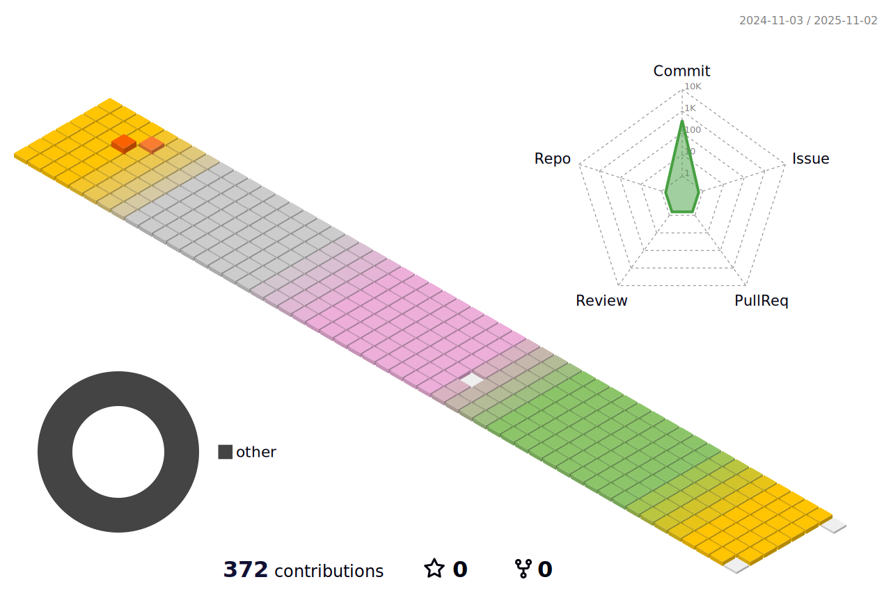

<!--
**Fizioo0102/Fizioo0102** is a ✨ _special_ ✨ repository because its `README.md` (this file) appears on your GitHub profile.

Here are some ideas to get you started:

- 🔭 I’m currently working on ...
- 🌱 I’m currently learning ...
- 👯 I’m looking to collaborate on ...
- 🤔 I’m looking for help with ...
- 💬 Ask me about ...
- 📫 How to reach me: ...
- 😄 Pronouns: ...
- ⚡ Fun fact: ...
-->

## 🛠️ Skills
**Backend**  
 
   
 
 
**Infra**  
 
    
## 📈 My Stat - Fizioo0102

## 🌱 Commit Log

## :mailbox_with_mail: Contacts

